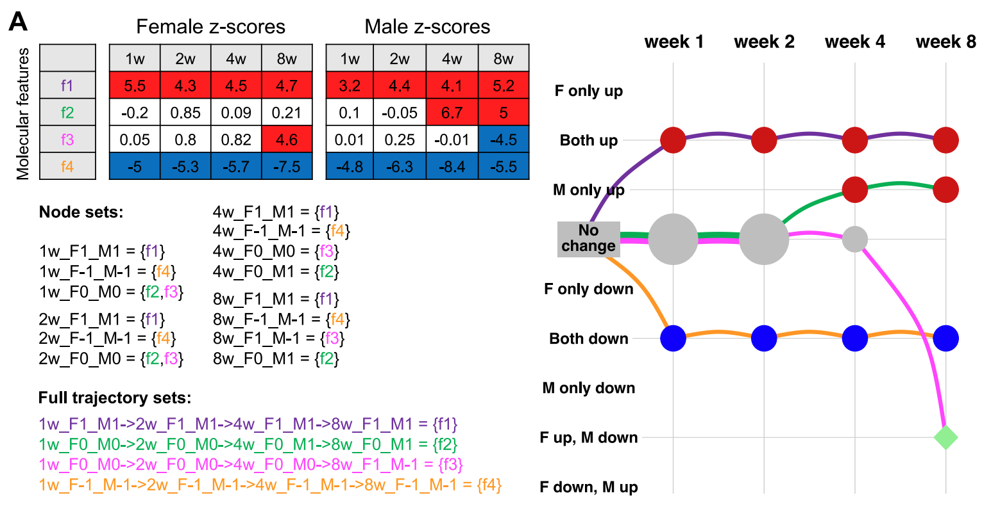
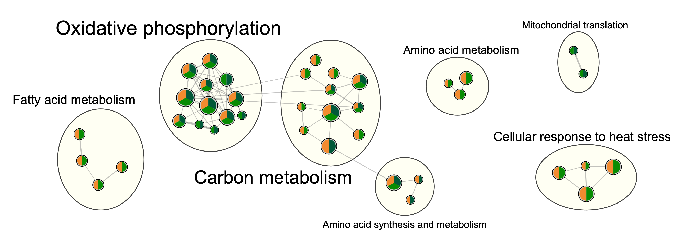

```{r, include = FALSE}
knitr::opts_chunk$set(
  collapse = TRUE,
  comment = "#>",
  fig.align = 'center'
)
```


<style>
div.blue {
  background-color: #e6f0ff; 
  border-radius: 10px; 
  padding-top: 20px; 
  padding-right: 20px; 
  padding-left: 20px; 
  padding-bottom: 10px; 
  margin-bottom: 20px; 
}
div.yellow {
  background-color: #fff5e6; 
  border-radius: 10px; 
  padding-top: 20px; 
  padding-right: 20px; 
  padding-left: 20px; 
  padding-bottom: 10px; 
  margin-bottom: 20px; 
}
#TOC {
  top: 1%;
  opacity: 0.5;
}
#TOC:hover {
  opacity: 1;
}
</style>


## Introduction 

<div class = "yellow">

If you run into problems,
please submit an issue [here](https://github.com/MoTrPAC/MotrpacRatTraining6mo/issues). 

</div>

### About this package 
This package provides functions to fetch, explore, and reproduce the processed 
data and downstream analysis results presented in the main paper for the first 
large-scale multi-omic multi-tissue endurance exercise training study conducted 
in young adult rats by the Molecular Transducers of Physical Activity Consortium 
(MoTrPAC). Find the [preprint on bioRxiv](https://www.biorxiv.org/content/10.1101/2022.09.21.508770v2).
**We highly recommend skimming the preprint 
before using this package as it provides important context and much greater detail
than we can provide here.**

<div class = "blue">

While some of the functions in this package can be used by themselves, they
were primarily written to analyze data in the 
[MotrpacRatTraining6moData](https://motrpac.github.io/MotrpacRatTraining6moData)
R package. See examples of how these data can be analyzed *without* this package in the 
[MotrpacRatTraining6moData vignette](https://motrpac.github.io/MotrpacRatTraining6moData/articles/MotrpacRatTraining6moData.html).

</div>

### About MoTrPAC 
MoTrPAC is a national research consortium designed to discover and perform 
preliminary characterization of the range of molecular transducers (the 
"molecular map") that underlie the effects of physical activity in humans. 
The program's goal is to study the molecular changes that occur during and after 
exercise and ultimately to advance the understanding of how physical activity 
improves and preserves health. The six-year program is the largest targeted NIH 
investment of funds into the mechanisms of how physical activity improves health 
and prevents disease. See [motrpac.org](https://www.motrpac.org/) and 
[motrpac-data.org](https://motrpac-data.org/) for more details. 

### Setup
If you have not yet installed this R package, follow instructions
[here](https://motrpac.github.io/MotrpacRatTraining6mo/#installation). Then load the library.
```{r this lib}
library(MotrpacRatTraining6mo)
```

As of v1.5.0, attaching `MotrpacRatTraining6mo` also attaches 
[MotrpacRatTraining6moData](https://motrpac.github.io/MotrpacRatTraining6moData), 
so an additional `library(MotrpacRatTraining6moData)` command is not necessary. 
For older versions of `MotrpacRatTraining6mo`, attach 
[MotrpacRatTraining6moData](https://motrpac.github.io/MotrpacRatTraining6moData) directly. 
Attaching [MotrpacRatTraining6moData](https://motrpac.github.io/MotrpacRatTraining6moData) 
makes it easier to load and look up documentation for data objects in the data package. 
```{r data lib, eval=FALSE}
library(MotrpacRatTraining6moData)
```

We will also load several suggested packages, which are required to run some of the 
examples in this vignette. 
```{r suggests}
suggests = c("gprofiler2","IHW","FELLA","foreach","KEGGREST","repfdr")
need_to_install = c()
for (p in suggests){
  if (!requireNamespace(p, quietly = TRUE)){
    need_to_install = c(need_to_install,p)
  }
}
if(length(need_to_install)>0){
  stop(sprintf("The following packages must be installed to run examples in this vignette:\n %s",
               paste(need_to_install, collapse=", ")))
}
```

<div class = "blue">

**Note:** Data objects from the [MotrpacRatTraining6moData](https://motrpac.github.io/MotrpacRatTraining6moData) 
package are indicated as variable names in all caps, e.g. `PHENO`, `TRNSCRPT_LIVER_RAW_COUNTS`. 

</div>


<div class = "blue">

**Tip:** To learn more about any data object or function, use `?` to retrieve the documentation,
e.g., [`?METAB_FEATURE_ID_MAP`](https://motrpac.github.io/MotrpacRatTraining6moData/reference/METAB_FEATURE_ID_MAP.html), 
`?load_sample_data`. Note that `MotrpacRatTraining6mo` must be installed and loaded with `library()` for this to work. 

</div>

## Study design 
Details of the experimental design can be found in the [supplementary methods of the bioRxiv preprint](https://www.biorxiv.org/content/biorxiv/early/2022/10/05/2022.09.21.508770/DC1/embed/media-1.pdf?download=true). 
Briefly, 6-month-old young adult rats 
were subjected to progressive endurance exercise training
for 1, 2, 4, or 8 weeks, with tissues collected 48 hours after the last training bout. 
Sex-matched sedentary, untrained rats were used as controls. Whole blood, plasma, 
and 18 solid tissues were analyzed using genomics, proteomics, metabolomics, 
and protein immunoassay technologies, with most assays performed in a subset of these tissues. 
Depending on the assay, between 3 and 6 replicates per sex per time point were
analyzed. 

## Tissue and assay abbreviations  
It is important to be aware of the tissue and assay abbreviations because they are used
to name data objects and define arguments for many functions. The vectors of abbreviations
are also available in `TISSUE_ABBREV` and `ASSAY_ABBREV`. 

### Tissues
* **ADRNL:** adrenal gland  
* **BAT:** brown adipose tissue  
* **BLOOD:** whole blood  
* **COLON:** colon  
* **CORTEX:** cerebral cortex  
* **HEART:** heart  
* **HIPPOC:** hippocampus  
* **HYPOTH:** hypothalamus  
* **KIDNEY:** kidney  
* **LIVER:** liver  
* **LUNG:** lung  
* **OVARY:** ovaries (female gonads)  
* **PLASMA:** plasma from blood
* **SKM-GN:** gastrocnemius (leg skeletal muscle)  
* **SKM-VL:** vastus lateralis (leg skeletal muscle) 
* **SMLINT:** small intestine  
* **SPLEEN:** spleen  
* **TESTES:** testes (male gonads)  
* **VENACV:** vena cava  
* **WAT-SC:** subcutaneous white adipose tissue  

### Assays/omes
* **ACETYL:** acetylproteomics; protein site acetylation  
* **ATAC:** chromatin accessibility, ATAC-seq data  
* **IMMUNO:** multiplexed immunoassays (cytokines and hormones)  
* **METAB:** metabolomics and lipidomics  
* **METHYL:** DNA methylation, RRBS data   
* **PHOSPHO:** phosphoproteomics; protein site phosphorylation  
* **PROT:** global proteomics; protein abundance  
* **TRNSCRPT:** transcriptomics, RNA-Seq data  
* **UBIQ:** ubiquitylome; protein site ubiquitination  

## Data in MotrpacRatTraining6moData 
While some of the functions in this package can be used by themselves, they
were primarily written to analyze data in the 
[MotrpacRatTraining6moData](https://motrpac.github.io/MotrpacRatTraining6moData/)
R package. 

Here is a brief summary of the kinds of data included in 
[MotrpacRatTraining6moData](https://motrpac.github.io/MotrpacRatTraining6moData/):

* Assay, tissue, sex, and training group abbreviations, codes, colors, and order used in plots
* Phenotypic data, `PHENO`
* Mapping between various feature identifiers, i.e., `FEATURE_TO_GENE`, `RAT_TO_HUMAN_GENE`  
* Ome-specific feature annotation, i.e., `METAB_FEATURE_ID_MAP`, `METHYL_FEATURE_ANNOT` (GCP only), `ATAC_FEATURE_ANNOT` (GCP only)
* Ome-specific sample-level metadata, i.e., `TRNSCRPT_META`, `ATAC_META`, `METHYL_META`, `IMMUNO_META`, `PHOSPHO_META`, `PROT_META`, `ACETYL_META`, `UBIQ_META`  
* Raw counts for RNA-Seq (TRNSCRPT), ATAC-Seq (ATAC), and RRBS (METHYL) data, 
e.g., `TRNSCRPT_LIVER_RAW_COUNTS`.
Note that epigenetic data (ATAC and METHYL) must be downloaded from Google Cloud Storage.  
* Normalized sample-level data, e.g., `TRNSCRPT_SKMGN_NORM_DATA`   
* Differential analysis results, e.g., `HEART_PROT_DA` (see more details below)  
* Sample outliers excluded from differential analysis, `OUTLIERS`  
* Table of training-regulated features at 5% FDR, `TRAINING_REGULATED_FEATURES`  
* Bayesian graphical analysis inputs and results (see more details below)  
* Pathway enrichment of main graphical clusters, `GRAPH_PW_ENRICH`  

For more details about the [MotrpacRatTraining6moData](https://motrpac.github.io/MotrpacRatTraining6moData)
R package, see its [vignette](https://motrpac.github.io/MotrpacRatTraining6moData/articles/MotrpacRatTraining6moData.html). The remainder of this vignette will focus on
functions available in [MotrpacRatTraining6mo](https://motrpac.github.io/MotrpacRatTraining6mo).  

[MotrpacRatTraining6mo](https://motrpac.github.io/MotrpacRatTraining6mo) 
includes several functions to easily fetch and compile data from 
[MotrpacRatTraining6moData](https://motrpac.github.io/MotrpacRatTraining6moData). 

Use `load_sample_data()` to load sample-level data for a specific ome and tissue. 
Here we fetch various forms of the sample-level RNA-Seq (TRNSCRPT) data for brown adipose tissue (BAT) as an example. 

```{r load sample data, eval=F}
# Load RNA-seq raw counts for brown adipose tissue 
data = load_sample_data("BAT", "TRNSCRPT", normalized = FALSE)

# Load the normalized RNA-seq data for brown adipose tissue instead
data = load_sample_data("BAT", "TRNSCRPT")

# Load the normalized RNA-seq data for brown adipose tissue, but exclude sample outliers 
data = load_sample_data("BAT", "TRNSCRPT", exclude_outliers = TRUE)

# Load the normalized RNA-seq data for brown adipose tissue for training-regulated features only
data = load_sample_data("BAT", "TRNSCRPT", training_regulated_only = TRUE)
```

`load_sample_data()` will tell you if the specified dataset doesn't exist. 
```{r load sample data 2}
data = load_sample_data("VENACV", "PROT")
```

`load_sample_data()` will also download epigenetic data from Google Cloud Storage.


<div class = "yellow">

**Note:** Epigenetic data require substantially more memory than other omes. 

</div>

```{r load epigen sample data, eval=F}
# Load ATAC-seq raw counts for hippocampus, excluding outliers 
data = load_sample_data("HIPPOC", 
                        "ATAC", 
                        exclude_outliers = TRUE, 
                        normalized = FALSE, 
                        scratchdir = "/tmp")
```

We can plot the normalized sample-level data for a single feature using
`plot_feature_normalized_data()`. All of the following examples are different
ways to plot the same feature. 
```{r plot_feature_normalized_data}
plot_feature_normalized_data(feature = "PROT;SKM-GN;NP_786937.1",
                             add_gene_symbol = TRUE)

plot_feature_normalized_data(assay = "PROT",
                             tissue = "SKM-GN",
                             feature_ID = "NP_786937.1",
                             exclude_outliers = TRUE,
                             scale_x_by_time = FALSE)

plot_feature_normalized_data(assay = "PROT",
                             tissue = "SKM-GN",
                             feature_ID = "NP_786937.1",
                             facet_by_sex = TRUE)
```

`combine_normalized_data()` is a wrapper for `load_sample_data()` that returns 
combined sample-level normalized data for multiple datasets. Note that the sample-specific 
vial labels used as column names for most of the sample-level data are replaced
with rat-specific participant IDs (PIDs) to allow measurements from multiple
datasets for the same animal to be concatenated. 
```{r combine normalized data, eval=F}
# Return all normalized RNA-seq data
data = combine_normalized_data(assays = "TRNSCRPT")

# Return all normalized proteomics data. Exclude outliers 
data = combine_normalized_data(assays = c("PROT","UBIQ","PHOSPHO","ACETYL"),
                               exclude_outliers = TRUE)

# Return normalized ATAC-seq data for training-regulated features 
data = combine_normalized_data(assays = "ATAC", 
                               training_regulated_only = TRUE)

# Return all non-epigenetic data
# Note that the "include_epigen" argument is FALSE by default
data = combine_normalized_data()
```

Similarly, `combine_da_results()` concatenates differential analysis results 
for multiple datasets. 
```{r combine da results, eval=F}
# Return all non-epigenetic differential analysis results, 
# including meta-regression results for metabolomics
res = combine_da_results()

# Return METHYL and ATAC differential analysis results for gastrocnemius 
res = combine_da_results(tissues="SKM-GN", 
                         assays=c("ATAC","METHYL"),
                         include_epigen=TRUE)
```

`transcript_prep_data()` and `atac_prep_data()` are functions used within the 
differential analysis functions for TRNSCRPT and ATAC data. 
They collect the filtered raw counts, normalized sample-level data, 
phenotypic data, and ome-specific sample metadata, covariates, and outliers 
associated with a given tissue. 

A few additional functions are provided to fetch epigenetic data from Google Cloud Storage:   

* **load_methyl_raw_data():** Return the unfiltered raw counts for a given tissue.  
* **load_methyl_feature_annotation():** Return the METHYL feature annotation file.  
* **load_atac_feature_annotation():** Return the ATAC feature annotation file.  
* **get_rdata_from_url():** If you know the URL for a specific RData file in GCS,
you can use this function to return the object using the `url` argument. Full URLs
for all of the epigenetic data are available in the [README for the MotrpacRatTraining6moData package](https://motrpac.github.io/MotrpacRatTraining6moData/#access-epigenomics-data-through-google-cloud-storage).  

Finally, `list_available_data()` returns a list of all of the available data 
objects in the specified package. 

```{r list available data}
list_available_data("MotrpacRatTraining6moData")
```

If the [MotrpacRatTraining6moData](https://motrpac.github.io/MotrpacRatTraining6moData/) library
is attached, you can learn more about any of these data objects with `?`, e.g., 
[`?TISSUE_COLORS`](https://motrpac.github.io/MotrpacRatTraining6moData/reference/TISSUE_COLORS.html),
and you can load data objects into your environment using `data()`, e.g., 
`data(TRAINING_REGULATED_FEATURES)`. 

## Differential analysis 
More details about the differential analysis methods are available in the 
[supplementary methods of the bioRxiv preprint](https://www.biorxiv.org/content/biorxiv/early/2022/10/05/2022.09.21.508770/DC1/embed/media-1.pdf?download=true). 
Simply put, the *training* differential 
analysis considers all training groups for each sex (sedentary controls and 4
training time points) to determine if the analyte significantly changes in either 
sex at any point during the training time course. The adjusted p-values from this analysis 
were used to determine the set of analytes that are regulated by endurance 
exercise training at 5% FDR, referred to as the *training-regulated features*. 
The *timewise* differential analysis performs pairwise contrasts between trained 
animals at each time point (1, 2, 4, or 8 weeks) and the sex-matched sedentary
control animals. This gives us sex- and time- specific p-values and effect sizes, 
referred to as the *timewise summary statistics*. 

We provide the following functions to replicate our *timewise* and *training* 
differential analysis results for each dataset. Look at the corresponding 
documentation for each function for more details, e.g. `?transcript_timewise_da`. 

* Proteomics (ACETYL, PHOSPHO, PROT, UBIQ)  
  * `proteomics_timewise_da()`  
  * `proteomics_training_da()`  
* ATAC  
  * `atac_training_da()`  
  * `atac_timewise_da()`  
* IMMUNO  
  * `immuno_timewise_da()`  
  * `immuno_training_da()`  
* METAB  
  * `metab_timewise_da()`  
  * `metab_training_da()`  
  * `metab_meta_regression()`  
* METHYL  
  * `rrbs_differential_analysis()`   
* TRNSCRPT  
  * `transcript_timewise_da()`  
  * `transcript_training_da()`  

Here, we replicate the protein acetylation timewise differential
analysis results provided in [MotrpacRatTraining6moData](https://motrpac.github.io/MotrpacRatTraining6moData/).

```{r replicate prot}
timewiseList = list()
for (tissue in c("HEART","LIVER")){
  timewiseList[[tissue]] = proteomics_timewise_da("ACETYL", tissue)
}
timewise = do.call("rbind", timewiseList)

# merge with version of results in MotrpacRatTraining6moData
original = combine_da_results(assays="ACETYL")
merged = merge(original, timewise, 
               by=c("feature_ID","assay","assay_code","tissue","tissue_code","sex","comparison_group"),
               suffixes=c("_orginal","_reproduced"))

# plot 
plot(-log10(merged$p_value_orginal), 
     -log10(merged$p_value_reproduced), 
     type="p", cex=0.5,
     xlab="Original timewise p-value (-log10)",
     ylab="Reproduced timewise p-value (-log10)",
     main="Timewise DA results for ACETYL data")
```

We can plot the differential analysis results for a single feature using 
`plot_feature_logfc()`. All of the following examples are different
ways to plot results for the same feature. 
```{r}
plot_feature_logfc(feature = "PROT;SKM-GN;NP_786937.1",
                   add_gene_symbol = TRUE)

plot_feature_logfc(assay = "PROT",
                   tissue = "SKM-GN",
                   feature_ID = "NP_786937.1",
                   scale_x_by_time = FALSE)

plot_feature_logfc(assay = "PROT",
                   tissue = "SKM-GN",
                   feature_ID = "NP_786937.1",
                   facet_by_sex = TRUE,
                   add_adj_p = FALSE)
```

## Bayesian graphical clustering 

### Summary 
After performing differential analysis between trained animals and sedentary control animals 
to identify training-regulated features across datasets,
we wanted to characterize groups of these features that had similar trajectories
over the training time course and compare them within and between tissues. 

To do this, we clustered the 34,244 training-regulated features with complete timewise summary 
statistics (that is, from all four training time points in both sexes) using their 
timewise z-scores with the expectation-maximization (EM) clustering algorithm of 
[repfdr](https://pubmed.ncbi.nlm.nih.gov/25012182/). 
This algorithm assumes that each timewise z-score can take one of three latent states: 
-1 for down-regulation, 1 for up-regulation, and 0 for null (i.e., unchanged 
relative to the sedentary control group). The algorithm computes the posterior 
probabilities for each combination of states (-1/down, 1/up, or 0/null) 
over all experimental groups (8 groups: 1-, 2-, 4-, and 8-week time points in females and males). 
We used these posterior probabilities to effectively assign continuous z-scores 
to simplified states. For example, a feature with the following z-scores would be 
assigned to the corresponding states with high probability:

|         | Female 1w | Male 1w | Female 2w | Male 2w | Female 4w | Male 4w | Female 8w | Male 8w |
| ------- | :-------: | :-----: | :-------: | :-----: | :-------: | :-----: | :-------: | :-----: |
| z-score | -0.2      | 0.1     | 0.85      | -0.05   | 0.09      | 6.7     | 0.21      | 5       |
| state   | 0         | 0       | 0         | 0       | 0         | 1       | 0         | 1       |


We then combine the male and female states for a given time point using the following notation:

|          | 1 week      | 2 weeks    | 4 weeks    | 8 weeks    |
| -------- | :---------: | :--------: | :--------: | :--------: | 
| notation | `1w_F0_M0`  | `2w_F0_M0` | `4w_F0_M1` | `8w_F0_M1` |


Descriptively, this feature is null in both sexes (`F0_M0`) at 1 week (`1w`) and
2 weeks (`2w`) of training and up-regulated in males only (`F0_M1`) at 4 and 8 weeks of training.  

One major advantage of this approach is that we can use the time points and discrete states
to construct a graph, where each point (or "node") in the graph represents a state at a given time point (e.g., `1w_F-1_M0`). 
Then for each feature of interest, we can draw a path through the graph to represent 
its trajectory over the training time course. We can use the paths and nodes in the graph
to define clusters of features with similar temporal behavior and characterize the underlying biology. 

For example, we can represent the complete path of the above feature over the training time course as follows: 
`1w_F0_M0->2w_F0_M0->4w_F0_M1->8w_F0_M1`. 
This path is made by connecting the `1w_F0_M0` node to the 
`2w_F0_M0` node to the `4w_F0_M1` node to the `8w_F0_M1` node. The connection 
between a single pair of consecutive nodes is called an edge. For example, the 
`2w_F0_M0---4w_F0_M1` edge represents features that are null in both sexes after
2 weeks of training but are up-regulated in males after 4 weeks of training. 
The `1w_F0_M0->2w_F0_M0->4w_F0_M1->8w_F0_M1` path is constructed from 3 edges, 
each represented by `->` in the notation. 

The figure below provides toy examples of four features to demonstrate their graphical representation. 
Feature `f2` (green) is the same trajectory described above. 

```{r, echo=FALSE, fig.cap="A. A schematic example of the graphical representation of the differential analysis results. Top left: the z-scores of four features. A positive score corresponds to up-regulation (red), and a negative score corresponds to down regulation (blue). Bottom left: the assignment of features to node sets and full path sets (edge sets are not shown for conciseness but can be easily inferred from the full paths). Node labels follow the [time]_F[x]_M[y] format where [time] shows the animal sacrifice week and can take one of (1w, 2w, 4w, or 8w), and [x] and [y] are one of (-1,0,1), corresponding to down-regulation, no effect, and up-regulation, respectively. Right: the graphical representation of the feature sets. Columns are training time points, and rows are the differential abundance states. Node and edge sizes are proportional to the number of features that are assigned to each set."}

```

We herein refer to our approach of using `repfdr` to construct a graph of the 
dynamic multi-omic responses to endurance exercise training across tissues as *graphical clustering*.
The following sections describe how to reproduce our graphical clustering analysis,
run `repfdr` on your own data, and explore and visualize the nodes, edges, and paths 
(collectively referred to as clusters) in the resulting graph. 
For additional details and advantages of this approach over traditional clustering methods, 
see the 
[supplementary methods of the bioRxiv preprint](https://www.biorxiv.org/content/biorxiv/early/2022/10/05/2022.09.21.508770/DC1/embed/media-1.pdf?download=true). 
If you are more interested in exploring the existing pathway enrichment results, skip to 
[Visualization of pathway enrichment results](#vizEnrich). 

### (Re-)run `repfdr` to determine states
`REPFDR_INPUTS` provides the inputs for our analysis
with `repfdr`, which can be replicated with `bayesian_graphical_clustering()` as shown below. 
The raw `repfdr` results are provided in `REPFDR_RES`. 
```{r bayesian_graphical_clustering, eval=F}
data(REPFDR_INPUTS)
zscores = REPFDR_INPUTS$zs_smoothed
res = bayesian_graphical_clustering(zscores)
```

`bayesian_graphical_clustering()` is a study-specific wrapper for `repfdr_wrapper()`. 
`repfdr_wrapper()` can be used to analyze any set of z-scores. 
Here we show an example with simulated data. 
```{r repfdr_wrapper, warning=FALSE, message=FALSE}
# load required library for this function
library(repfdr)

# Simulate data with a single null cluster
# Toy experiment with 8 groups 
zcolnames = paste("Exp", 1:8)
zscores = matrix(rnorm(80000),ncol=8,dimnames = list(1:10000,zcolnames))
# Add a cluster with a strong signal,
# i.e. assign a z-score of ~5 to the first 4 groups for the first 500 features
zscores[1:500,1:4] = zscores[1:500,1:4] + 5
# Run the repfdr wrapper
repfdr_results = repfdr_wrapper(zscores, df=10)

# Now we expect the first 500 features to belong to cluster 11110000 (up-regulated in the first 4 groups)
# and the remaining 9500 to belong to cluster 00000000 (null in all groups)
hist(repfdr_results$repfdr_cluster_posteriors[,"00000000"], 
     breaks=20, 
     main="Posterior probability of null cluster for all features")
hist(repfdr_results$repfdr_cluster_posteriors[1:500,"11110000"], 
     breaks=20, 
     main="Posterior probability of 11110000 cluster for first 500 features")
```

### Explore graphical clustering results
The graph representation of the `repfdr` results are provided in 
`GRAPH_COMPONENTS` (node and edge lists) and 
`GRAPH_STATES` (data frame representation).
```{r graph}
data(GRAPH_STATES)
head(GRAPH_STATES)
```

<div class = "blue">

**Note:** Features are specified in the format "[ASSAY_ABBREV];[TISSUE_ABBREV];[feature_ID]",
e.g. "PHOSPHO;SKM-GN;NP_001006973.1_S34s", "METAB;SKM-GN;1-methylnicotinamide"

</div>

We can extract node, edge, and path feature sets from a given tissue using `extract_tissue_sets()`. 
Here we extract training-regulated features in the three (`k=3`) largest nodes, edges, and paths
in the gastrocnemius (`tissues="SKM-GN"`) that have at least 20 features (`min_size=20`).
We also add the feature lists for all 8-week nodes (`add_week8=TRUE`), which are generally of 
interest because the 8-week time point represents the final trained state. 
```{r extract tissue sets}
gastroc_sets = extract_tissue_sets(tissues="SKM-GN",
                                   k=3,
                                   min_size=20,
                                   add_week8=TRUE)
names(gastroc_sets)

# look at the list of features in the "1w_F1_M1->2w_F1_M1->4w_F1_M1->8w_F1_M1" path
head(gastroc_sets$`1w_F1_M1->2w_F1_M1->4w_F1_M1->8w_F1_M1`)
```

`get_all_trajectories()` returns all non-empty *paths* in the results. 
```{r get all trajectories}
paths = get_all_trajectories()
head(names(paths))
hist(unlist(lapply(paths, length)), breaks=100)
```

`extract_main_clusters()` returns the subset of graphical clusters for which pathway 
enrichment was performed for the [preprint](https://www.biorxiv.org/content/10.1101/2022.09.21.508770v2), 
namely the 2 largest nodes, 2 largest edges, 10 largest non-null paths, and all 8-week nodes from the graphical 
representation of training-regulated features in each tissue.  
```{r extract main clusters}
clusters = extract_main_clusters()
```

To extract the training-regulated features associated with a specific graphical cluster, 
tissue, ome, etc., we can subset `GRAPH_STATES`.
```{r extract features}
data(GRAPH_STATES)

# if you want features in this path in LUNG:
clust = "LUNG:1w_F1_M-1->2w_F1_M-1->4w_F0_M-1->8w_F-1_M-1"
features_of_interest = stats::na.omit(GRAPH_STATES$feature[GRAPH_STATES$tissue_path == clust])
as.vector(features_of_interest)

# if you want features in this path in multiple tissues:
clust = "1w_F1_M1->2w_F1_M1->4w_F1_M1->8w_F1_M1"
tissues = c("HEART","SKM-GN","SKM-VL")
features_of_interest = stats::na.omit(GRAPH_STATES$feature[GRAPH_STATES$path == clust & GRAPH_STATES$tissue %in% tissues])
length(features_of_interest)
# look at a table of omes and tissues represented 
tissues = sapply(features_of_interest, function(x){
  unname(unlist(strsplit(x, ";")))[2]
})
omes = sapply(features_of_interest, function(x){
  unname(unlist(strsplit(x, ";")))[1]
})
table(tissues, omes)
```

### Plot graph of differential features 
We can use `get_tree_plot_for_tissue()` to draw the graphical representation 
of a given set of training-regulated features. 

First, let's look at the graph of all differential features in the liver. 
The sizes of the edges and nodes are proportional to the number of training-regulated features
that were assigned to the corresponding states. Nodes are arranged in rows by states
(e.g., "F only up") and in columns by training time points. The node at the intersection of
"F only up" and "week 1" represents features that are null in males and up-regulated in 
females after one week of endurance exercise training (i.e., `1w_F1_M0` in the notation above). 
```{r tree plot 1, fig.width = 10, fig.height = 6, warning=FALSE}
get_tree_plot_for_tissue(
  tissues=c("LIVER"),
  min_size = 1
)
```

This is messy, so let's look at just the 5 largest paths instead. 
```{r tree plot 2, fig.width = 10, fig.height = 6, warning=FALSE}
get_tree_plot_for_tissue(
  tissues=c("LIVER"),
  max_trajectories = 5
)
```

Further, let's split these edges by data type (assay/ome) to see what features are represented. 
We can change the curvature and alpha range to make the edges easier to see. 
```{r tree plot 3, fig.width = 10, fig.height = 6, warning=FALSE}
get_tree_plot_for_tissue(
  tissues=c("LIVER"),
  max_trajectories = 5,
  parallel_edges_by_ome = TRUE,
  curvature = 0.5,
  edge_alpha_range = c(0.5,1)
)
```

This is too busy with edges split by ome. Let's look at just the largest path and only RNA-Seq and proteomics assays. 
```{r tree plot 4, fig.width = 10, fig.height = 6, warning=FALSE}
get_tree_plot_for_tissue(
  omes=c("PROT","ACETYL","UBIQ","PHOSPHO","TRNSCRPT"),
  tissues=c("LIVER"),
  max_trajectories = 1,
  parallel_edges_by_ome = TRUE,
  curvature = 0.8,
  edge_alpha_range = c(0.5,1)
)
```

From this plot, we can see that most of the differential features that follow this path in the liver are protein acetlysites. 
This path represents features that are up-regulated only in males ("M only up") through the first four weeks of training and then in both
males and females by eight weeks of training ("Both up"). 

We can also look at multi-tissue graphs. For example, let's look at the three largest paths of training-regulated
transcripts in the three muscle tissues. Now instead of splitting edges by ome, we can split them by tissue. 
```{r tree plot 5, fig.width = 10, fig.height = 6, warning=FALSE}
get_tree_plot_for_tissue(
  tissues=c("SKM-GN","HEART","SKM-VL"),
  omes="TRNSCRPT",
  parallel_edges_by_tissue = TRUE,
  max_trajectories = 3,
  edge_alpha_range = c(0.5,1),
  curvature = 0.6
)
```

From this plot, we can see that a large number of training-regulated transcripts are 
up-regulated in both sexes at all four training time points
in all three muscle tissues. Perhaps some interesting shared biology is 
represented in muscle features that follow this path. 

To visualize the representation of features from different tissues and/or omes for a given set of clusters, 
we can also use `plot_features_per_cluster()`. Here, we'll consider the 10 largest paths
of training-regulated features in the gastrocnemius (lower leg skeletal muscle). 
```{r plot_features_per_cluster, fig.height=3, fig.width=9}
# Get top 10 largest paths, nodes, edges in gastrocnemius
# Exclude additional 8-week nodes
clusters = extract_tissue_sets("SKM-GN", k=10, add_week8=FALSE)
# Select paths only
clusters = clusters[grepl("->", names(clusters))]
# Plot distribution of features
plot_features_per_cluster(clusters)
```

From this plot, we see that the majority of training-regulated features in the
gastrocnemius that are up-regulated in both sexes at all training time points 
(`1w_F1_M1->2w_F1_M1->4w_F1_M1->8w_F1_M1`, top row) are proteins, followed
by protein phosphosites. We can plot the sample-level trajectories of all features
in this cluster with `plot_feature_trajectories()`. 
```{r plot_feature_trajectories}
plot_feature_trajectories(clusters$`1w_F1_M1->2w_F1_M1->4w_F1_M1->8w_F1_M1`, 
                          title="Features consistently up-regulated in gastroc")
```

We also see a cluster comprised mostly of protein 
phosphosites, where these features are down-regulated in females at all training
time points and also down-regulated in males at 8 weeks of training 
(`1w_F-1_M0->2w_F-1_M0->4w_F-1_M0->8w_F-1_M-1`). 
```{r plot_feature_trajectories 2}
plot_feature_trajectories(clusters$`1w_F-1_M0->2w_F-1_M0->4w_F-1_M0->8w_F-1_M-1`, 
                          title="Cluster of mostly PHOSPHO in gastroc")
```

In the next section, we show how 
pathway enrichment can be used to begin interpreting the biology underlying a 
graphical cluster (node, edge, or path) of interest. 

## Pathway enrichment of clusters
One important tool we used to interpret the biology underlying graphical clusters
was pathway enrichment. In this section, we describe functions provided in this package
to reproduce our pathway enrichment analysis or run your own. 
If you are more interested in exploring the existing pathway enrichment results, skip to 
[Visualization of pathway enrichment results](#vizEnrich). 

### Approach
We performed pathway enrichment for the 2 largest nodes, 
2 largest edges, 10 largest non-null paths, and all 8-week nodes from the graphical 
representation of training-regulated features in each tissue. This set of 
graphical clusters can be extracted using `extract_main_clusters()`. 

For each tissue-specific cluster, we performed pathway enrichment separately for the
features corresponding to each ome. For gene-centric omes, i.e., all but metabolomics, 
we mapped features to genes and queried [KEGG](https://pubmed.ncbi.nlm.nih.gov/33125081/) 
and [REACTOME](https://pubmed.ncbi.nlm.nih.gov/31691815/) pathways using 
[gprofiler2](https://pubmed.ncbi.nlm.nih.gov/33564394/). 
For metabolomics, we mapped metabolites to KEGG IDs and used 
[FELLA](https://bmcbioinformatics.biomedcentral.com/articles/10.1186/s12859-018-2487-5) to query
KEGG pathways. The feature-to-gene and metabolite-to-KEGG ID mappings are
provided in `FEATURE_TO_GENE`.

For each enrichment test, we specified the background/universe as the set of genes 
or metabolite IDs that were tested for differential analysis in that tissue. These
backgrounds are provided in `GENE_UNIVERSES`. If you are performing your own pathway
enrichment analyses, it is important to specify the appropriate background to avoid 
artificially small p-values. 

Pathway enrichment results were adjusted over *all* tests using 
[IHW](https://www.nature.com/articles/nmeth.3885) with tissue as a covariate. 

Pathway enrichment results for graphical clusters of interest presented in the 
[preprint](https://www.biorxiv.org/content/10.1101/2022.09.21.508770v2) are provided in `GRAPH_PW_ENRICH`. 

### Enrichment with standard PWs 
`cluster_pathway_enrichment()` is a wrapper for 
[gprofiler2::gost()](https://rdrr.io/cran/gprofiler2/man/gost.html)
and [FELLA::enrich()](https://rdrr.io/bioc/FELLA/man/enrich-funs.html), 
where metabolomics pathway enrichment is performed for KEGG pathways, and gene-centric
pathway enrichment can be performed for any set of 
[pathway databases accepted by g:Profiler](https://rdrr.io/cran/gprofiler2/man/gost.html). 

Here we show an example of performing pathway enrichment on two clusters of training-regulated
features, one from each of two tissues. In this case, clusters are determined using the graphical clustering approach
described above, but in practice the clusters could be identified using any approach (e.g., k-means, fuzzy C-means). 

First, extract the clusters of interest. Here `paths` is a named list, where
the names are the names of the cluster and the values are vectors of the corresponding
training-regulated features. 
```{r}
# extract the top path from gastrocnemius and heart 
paths = list()
for (tissue in c("SKM-GN","HEART")){
  # extract top node, edge, path
  clusters = extract_tissue_sets(tissue, k=1, add_week8=FALSE)
  # select the path only, which contains "->"
  top_path = clusters[grepl("->", names(clusters))]
  # add to list 
  paths[[paste0(tissue, ":", names(top_path)[1])]] = top_path[[1]]
}
names(paths)
lapply(paths, head)
```

Now perform pathway enrichment. First, we will run the function without specifying
`kegg_db_destination`, which will force it to ignore metabolites. By default, KEGG
and REACTOME pathways are queried. 
```{r pw enrich}
# load required libraries for this function
library(gprofiler2)
library(foreach)
# to learn more about the arguments and default parameters, look at `?cluster_pathway_enrichment`
res1 = cluster_pathway_enrichment(paths)
```

We get a few warnings and messages. 

* First, we get a warning that pathway enrichment will not be 
performed with metabolites because `kegg_db_destination=NULL` (default parameter).   
* Second, we are told that the analysis will be run on a single core. If you are 
performing pathway enrichment for more than a few clusters, the runtime will be 
dramatically reduced if you parallelize the analysis on more than one core. You can do this 
by specifying the `num_cores` argument. `cluster_pathway_enrichment()` internally uses 
`doParallel::registerDoParallel(num_cores)` to register more than one core.  
* Third, we are told that one of the gastrocnemius ATAC-seq features is not specified 
in the background (`GENE_UNIVERSES$ensembl_gene` by default) and is therefore excluded
from the analysis. This is because we decided to define ATAC-seq (ATAC) and RRBS (METHYL) universes 
according to the *expressed genes* in each tissue, i.e., using the RNA-seq (TRNSCRPT) data.
Therefore, there are some differential ATAC/METHYL features where the corresponding 
gene is not regulated by training. This is one such case.  
* Finally, we get a message from `IHW::ihw()`: "We recommend that you supply (many) 
more than 1000 p-values for meaningful data-driven hypothesis weighting results." 
With this few tests, one could reasonably perform BH-adjustment across all tests instead 
of using IHW to consider distributions of p-values from each tissue.

Let's look at how many significantly enriched pathways we get at 5% FDR.
```{r}
nrow(res1[res1$adj_p_value < 0.05,])
# split by tissue and ome
significant = res1[res1$adj_p_value < 0.05,]
table(significant$tissue, significant$ome)
```

Now let's perform pathway enrichment on the same clusters, this time including 
metabolites in the analysis by specifying `kegg_db_destination`. 
In this case, `cluster_pathway_enrichment()` calls the `run_fella()` helper function, 
which is a convenient [FELLA](https://bmcbioinformatics.biomedcentral.com/articles/10.1186/s12859-018-2487-5) 
wrapper to perform KEGG pathway enrichment with metabolites. 

If you have not yet installed the KEGG database, e.g., with `make_kegg_db()`, `kegg_db_destination`
must point to a directory that **does not yet exist** and will be where the KEGG 
database needed to run 
[FELLA](https://bmcbioinformatics.biomedcentral.com/articles/10.1186/s12859-018-2487-5) is installed. 
If necessary, `make_kegg_db()` is called within `cluster_pathway_enrichment()` to 
install the KEGG database. If you have already installed the KEGG database, 
`kegg_db_destination` should point to its parent directory. For this example, 
assume the KEGG database has already been installed in `~/kegg/20220919`. 
```{r metab enrich, eval=F}
# load required libraries for pathway enrichment with metabolites
library(FELLA)
library(KEGGREST)
# to learn more about the arguments and default parameters, look at `?cluster_pathway_enrichment`
res2 = cluster_pathway_enrichment(paths,
                                  kegg_db_destination = "~/kegg/20220919",
                                  fella_method = "hypergeom") # "hypergeom" or "diffusion"
```

### Enrichment with custom PWs  
If you want to query pathways not available through `gProfiler`,
`custom_cluster_pathway_enrichment()` can be used to perform pathway enrichment 
for custom pathway annotations. Here we show an example with a single cluster of 
features and a single annotated pathway. 

Note that features in the input must still 
be in the format "[ASSAY_ABBREV];[TISSUE_ABBREV];[feature_ID]",
e.g. "PHOSPHO;SKM-GN;NP_001006973.1_S34s", "METAB;SKM-GN;1-methylnicotinamide",
where feature IDs are included in the supplied `feature_to_gene` map 
(`FEATURE_TO_GENE` by default). The `universe`/background must also be specified
using the same kind of gene identifier as the pathway annotation (rat gene symbols in this case). 
```{r custom pw enrich}
# Use graphical clusters as an example
cluster_res = extract_main_clusters()
# Pick a single graphical cluster
# Gastrocnemius features up-regulated in both males and females at 8 weeks of training
cluster_res = cluster_res[cluster_res$cluster == "SKM-GN:8w_F1_M1",]

# Make a toy pathway member list with human gene symbols
pathways = list("TCA cycle" = c('ACO2','CS','FH','MDH1','OGDH','PDHA1','PDHA2','SDHC','SUCLG1'))

# Convert human gene symbols to rat gene symbols
data(RAT_TO_HUMAN_GENE)
for (pw in names(pathways)){
  newmembers = c()
  for (m in pathways[[pw]]){
    # get rat symbol
    rat = RAT_TO_HUMAN_GENE$RAT_SYMBOL[RAT_TO_HUMAN_GENE$HUMAN_ORTHOLOG_SYMBOL == m][1]
    if(!is.na(rat)){
      newmembers = c(newmembers, rat)
    }
  }
  pathways[[pw]] = newmembers
}

# Perform pathway enrichment
# Note that the type of gene identifier used to specify the background
# must match the type of gene identifier used in the custom pathway annotation 
res = custom_cluster_pathway_enrichment(cluster_res,
                                        pathway_member_list = pathways,
                                        gene_identifier_type = "gene_symbol", 
                                        universe = GENE_UNIVERSES$gene_symbol,
                                        min_pw_set_size = 5)
res[,c("term_name","intersection","tissue","ome","computed_p_value","adj_p_value")]
```

Note we get one result per tissue and ome combination. 

### Simple enrichment with single gene set

We also provide the `gene_pathway_enrichment()` function for pathway enrichment of a single list of genes. 
This is a simple wrapper for [gprofiler2::gost()](https://rdrr.io/cran/gprofiler2/man/gost.html). 
```{r gene_pathway_enrichment}
# Perform pathway enrichment for differential transcripts in the liver

# get all differential TRNSCRPT feature IDs in the liver
diff = MotrpacRatTraining6moData::TRAINING_REGULATED_FEATURES
input_feat = diff$feature_ID[diff$tissue == "LIVER" & diff$assay == "TRNSCRPT"]
# get corresponding gene symbols
map = MotrpacRatTraining6moData::FEATURE_TO_GENE_FILT
input = unique(map$gene_symbol[map$feature_ID %in% input_feat])
# define background - all expressed genes in the liver, defined as gene symbols
background = MotrpacRatTraining6moData::GENE_UNIVERSES$gene_symbol$TRNSCRPT$LIVER
# perform pathway enrichment 
res = gene_pathway_enrichment(input, background)
head(res)
```

## Visualization of PW enrichments {#vizEnrich}

### Approach
After performing pathway enrichment for our graphical clusters of interest, we
observed that many clusters had many dozens of significantly enriched pathways. 
In order to make these results more digestible, we leveraged
[visNetwork](https://cran.r-project.org/web/packages/visNetwork/vignettes/Introduction-to-visNetwork.html)
to construct interactive networks of pathway enrichments. These networks are 
conceptually similar to those made by the [EnrichmentMap](https://apps.cytoscape.org/apps/enrichmentmap)
Cytoscape module, but it's easier to generate them and explore the underlying data. 

Briefly, each node in the network is a pathway, and edges connect highly similar
pathways, i.e., those whose enrichments are driven by highly similar sets of genes
across omes (see infographic). This groups together highly similar pathway enrichments, which makes
it easier to digest large numbers of results. 

```{r, echo=FALSE}
knitr::include_graphics("pw_network.png", dpi=150)
```

In our implementation, groups of similar pathway enrichments are color-coded, and 
group labels are inferred from the term names and parents of the pathways in the group. 
Larger nodes indicate that the pathway was significantly enriched in multiple 
datasets; thicker edges indicate higher similarity between the pathways. 

Best of all, these networks are interactive! Use your cursor to zoom and drag,
and hover over nodes and edges to see more information about the underlying data, 
namely the genes and datasets driving the pathway enrichment. 

### Minimal example: single tissue 
Here we show the interactive network of pathway enrichments corresponding to 
training-regulated features that are up-regulated in the gastrocnemius in both
sexes at the 8-week time point, i.e. `SKM-GN:8w_F1_M1`. 
```{r viznetwork1, fig.width=8}
enrichment_network_vis(tissues="SKM-GN",
                       cluster="8w_F1_M1")

# # Equivalently:
# data(GRAPH_PW_ENRICH)
# pw = GRAPH_PW_ENRICH[GRAPH_PW_ENRICH$cluster == "SKM-GN:8w_F1_M1",]
# enrichment_network_vis(pw)
```

Note that you could run this function with any pathway enrichment results, 
as long as the columns of `pw_enrich_res`
include "adj_p_value", "ome", "tissue", "intersection", "computed_p_value", "term_name", and "term_id" 
and the columns of `feature_to_gene` include "gene_symbol", "ensembl_gene". 
`feature$ensembl_gene` can be a dummy column if `intersection_id_type = "gene_symbol"`. 

### Example with multiple tissues 
Now let's examine pathways that are enriched in the same graphical cluster for
multiple tissues. For this example, we'll consider features that are up-regulated
in both males and females at the 8-week training time point (`8w_F1_M1`)
in any of our three muscle tissues (heart, gastrocnemius, vastus lateralis). 

If we are specifically interested in pathways that are significantly enriched in
multiple tissues, we can set `multitissue_pathways_only` to `TRUE`. This removes 
any pathways that are not enriched in more than one tissue (in at least one ome). 
```{r viznetwork2, fig.width=8}
enrichment_network_vis(tissues=c("HEART","SKM-GN","SKM-VL"),
                       cluster="8w_F1_M1", 
                       multitissue_pathways_only = TRUE)

# # Equivalently:
# pw = GRAPH_PW_ENRICH[grepl(":8w_F1_M1", GRAPH_PW_ENRICH$cluster) & 
#                        GRAPH_PW_ENRICH$tissue %in% c("HEART","SKM-GN","SKM-VL"),]
# enrichment_network_vis(pw, multitissue_pathways_only = TRUE)
```

### Examples with other parameters
Let's go back to our simple example for input pathway enrichment results. 
```{r}
pw = GRAPH_PW_ENRICH[GRAPH_PW_ENRICH$cluster == "SKM-GN:8w_F1_M1",]
```

#### Move or remove group labels
By default, the color-coded node group labels are shown on the left side
of the plot. To make it easier to match labels to groups of pathways, 
we can set the `add_group_label_nodes` argument to `TRUE`. 
If you're zoomed out, hover over a label to display it in larger font. 
```{r viznetwork3, fig.width=8}
enrichment_network_vis(pw, add_group_label_nodes = TRUE)

# # Equivalently:
# enrichment_network_vis(tissues="SKM-GN",
#                        cluster="8w_F1_M1",
#                        add_group_label_nodes = TRUE)
```

You can also remove group labels entirely with `label_nodes = FALSE`. 
```{r viznetwork4, fig.width=8}
enrichment_network_vis(pw, label_nodes = FALSE)

# # Equivalently:
# enrichment_network_vis(tissues="SKM-GN",
#                        cluster="8w_F1_M1",
#                        label_nodes = FALSE)
```

#### Save similarity scores
Notice that each time we run this function, it takes more than 10 seconds to execute. 
If you want to play with the parameters of `enrichment_network_vis()` for the same
pathway enrichment results, you can save the pathway similarity scores in a file 
to avoid re-computing them each time, which is the most computationally expensive
step in this function. 

`similarity_scores_file` must specify an RDS file (suffix .rds or .RDS).
The first time the function is run with a non-null `similarity_scores_file` argument, 
the scores are computed and saved to the given RDS file. 
Then future calls to this function with `similarity_scores_file`
set to an existing file will load the scores from the file instead of re-computing them. 
Notice the dramatic difference in elapsed time for these two function calls. 

```{r, include=FALSE}
if(file.exists("/tmp/SKM-GN_8w_F1_M1_scores.RDS")){
  file.remove("/tmp/SKM-GN_8w_F1_M1_scores.RDS")
}
```

```{r viznetwork5}
system.time(
  enrichment_network_vis(pw, similarity_scores_file = "/tmp/SKM-GN_8w_F1_M1_scores.RDS", verbose=FALSE)
)
system.time(
  enrichment_network_vis(pw, similarity_scores_file = "/tmp/SKM-GN_8w_F1_M1_scores.RDS", verbose=FALSE)
)
```

#### Remove METAB-only enrichments
Since metabolites are not readily mapped to genes, they cannot easily be incorporated
into this network where pathway similarity is calculated using the overlap of gene symbols. 
Therefore, pathway enrichments driven exclusively by metabolites are treated differently. 
If two pathways are driven exclusively by metabolites, an artificial edge is drawn between 
them if at least one non-stopword overlaps between the pathway names or parent pathway names. 
Otherwise, the pathways are represented as singleton nodes. 
To exclude pathways enriched only by differential metabolites set `include_metab_singletons` to `FALSE`.
```{r viznetwork6, fig.width=10}
enrichment_network_vis(pw, include_metab_singletons=FALSE)
```

#### Export a network to Cytoscape
The output of `enrichment_network_vis()` is nice for exploration, but it comes short
of publication-ready figures. You can export a network to Cytoscape to manually
polish it. For this code to work, you need to install the 
[RCy3 R package](https://bioconductor.org/packages/release/bioc/html/RCy3.html) 
and have Cytoscape running locally. 
```{r viznetwork7, eval=FALSE}
library(RCy3)
vn = enrichment_network_vis(pw,
                            title = "SKM-GN:8w_F1_M1",
                            return_graph_for_cytoscape = TRUE) 
cytoscapePing()
createNetworkFromIgraph(vn, new.title='gastroc-8w-both-up')
```

Once you've imported the network into Cytoscape, you can import the style sheet found 
[here](https://github.com/MoTrPAC/MotrpacRatTraining6mo/blob/vignette/cytoscape/enrichment_network_style.xml)
and follow [these instructions](https://docs.google.com/presentation/d/1RvEluLJ1RfAEGsWyiAet1xTuDzxiMOmYqNdWHnxedhI/edit?usp=sharing) to quickly make beautiful network with nodes colored by 
either tissue or ome. For example: 


### Printing networks within a loop
Rendering `visNetwork` objects within a loop has some known challenges. See solutions [here](https://stackoverflow.com/questions/47577894/r-markdown-visnetwork-not-displayed-in-html-output-when-using-for-loops-or-fun/). 

## Getting help 
For questions, bug reporting, and feature requests for this package, please 
[submit a new issue](https://github.com/MoTrPAC/MotrpacRatTraining6mo/issues) 
and include as many details as possible. 

If the concern is related to data provided in the `MotrpacRatTraining6moData`
package, please submit an issue 
[here](https://github.com/MoTrPAC/MotrpacRatTraining6moData/issues) instead. 

## Acknowledgements 
MoTrPAC is supported by the National Institutes of Health (NIH) Common
Fund through cooperative agreements managed by the National Institute of Diabetes and
Digestive and Kidney Diseases (NIDDK), National Institute of Arthritis and Musculoskeletal
Diseases (NIAMS), and National Institute on Aging (NIA). 

## Session Info 
```{r session info}
sessionInfo()
```
